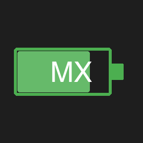

# MX Battery — Stream Deck Plugin

Displays the battery percentage of a **Logitech MX Master 3S** mouse and **MX Keys S** keyboard connected via a **Logi Bolt** USB receiver directly on your Stream Deck keys.



## Features

- Two actions: **MX Master 3S Battery** and **MX Keys S Battery**
- Color-coded battery gauge rendered directly on the key:
  - 🟢 Green — 50 % and above
  - 🟠 Orange — 20 – 49 %
  - 🔴 Red — below 20 %
- Polls every **5 minutes** automatically
- Press the key to **force an immediate refresh**
- macOS only (Mac Mini M1 / Apple Silicon supported)

## Requirements

| Requirement | Details |
|---|---|
| Stream Deck software | 6.9 or later |
| macOS | 12 (Monterey) or later |
| Python | 3.10 at `/usr/local/bin/python3` |
| hidapi Python binding | `pip3 install hidapi` |
| Logi Bolt receiver | USB vendor `0x046D`, product `0xC548` |

### Install hidapi

```bash
pip3 install hidapi
```

## Installation

1. Download `com.fedeltamedia.mxbattery.streamDeckPlugin` from the [latest release](../../releases/latest).
2. Double-click the file — Stream Deck will install it automatically.
3. Drag **MX Master 3S Battery** and/or **MX Keys S Battery** from the action list onto any key.

## How it works

The plugin calls a bundled Python helper (`bin/battery.py`) via `child_process.execFile`. The helper communicates with the Logi Bolt receiver using the **HID++ protocol**:

- Opens the HID device at `vendor=0x046D`, `product=0xC548`, `usage_page=0xFF00`
- Queries **Unified Battery** feature (HID++ feature `0x1004`, firmware index `0x08`)
- `device_idx 0x02` → MX Master 3S mouse
- `device_idx 0x01` → MX Keys S keyboard
- Response byte 4 contains the battery percentage

## Development

```bash
git clone https://github.com/FedeltaMedia/mx-battery.git
cd mx-battery
npm install
npm run build   # compiles TypeScript → com.fedeltamedia.mxbattery.sdPlugin/bin/plugin.js
npm run pack    # builds + creates .streamDeckPlugin release file
npm run watch   # live-reload during development (requires Stream Deck app)
```

## License

MIT
